# 三下数学总目录

[第一单元](# 第一单元-位置与方向)

[第二单元](#第二单元-除数是一位数的除法)

[第三单元](#第三单元-复式统计表)

[第四单元](#第四单元-两位数乘两位数)

[第五单元](#第五单元-面积)

[第六单元](#第六单元-年月日)

[第七单元](#第七单元-小数的初步认识)

[第八单元](#数学广角-搭配（二）)

## 第一单元 位置与方向

## 第二单元 除数是一位数的除法

  
  

## 第三单元 复式统计表

  
  

## 第四单元 两位数乘两位数

  
  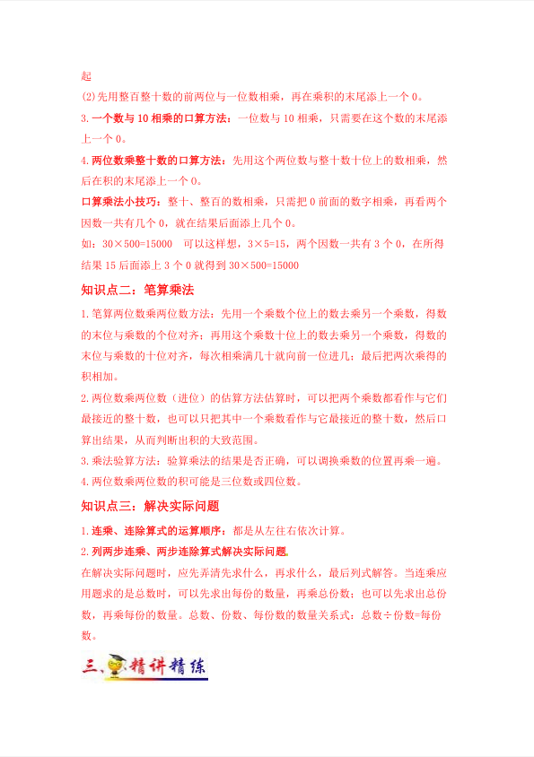
  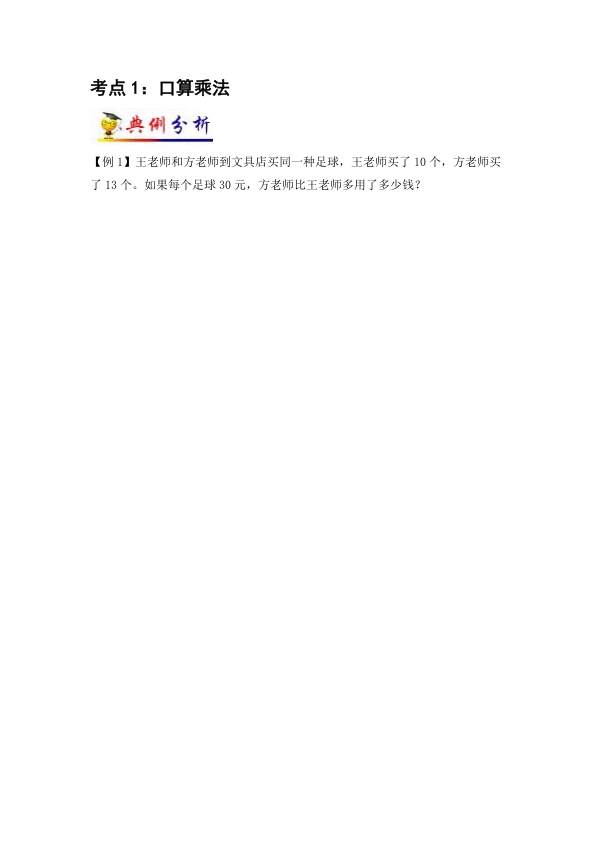

## 第五单元 面积

  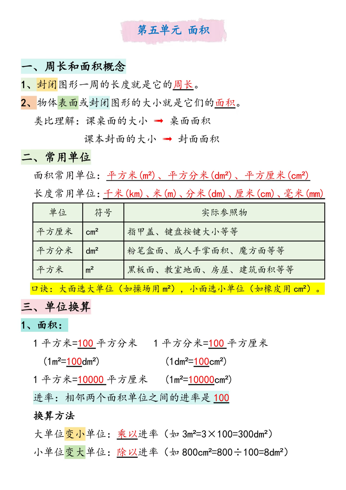
  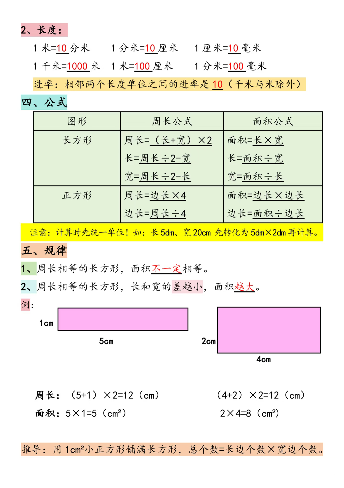
  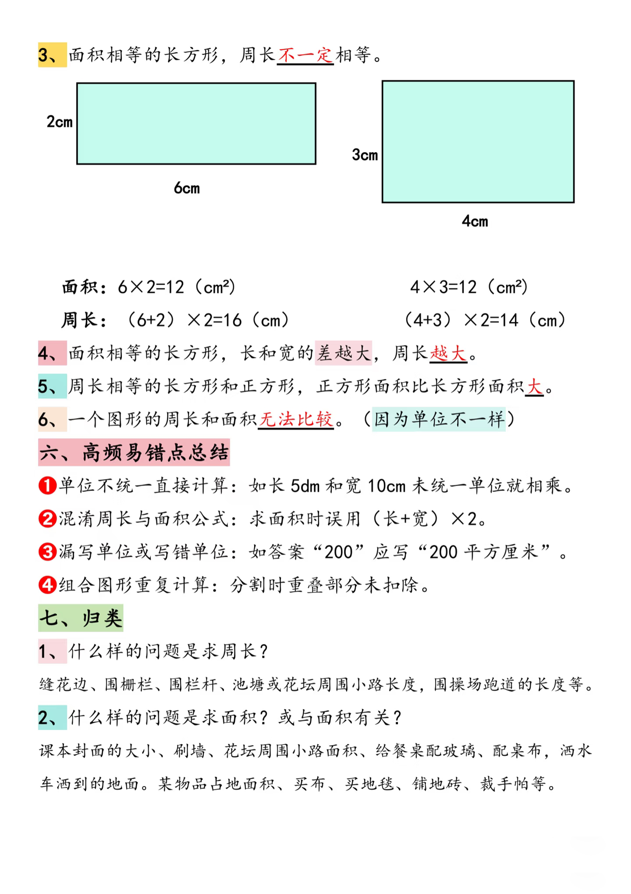

## 第六单元 年、月、日

  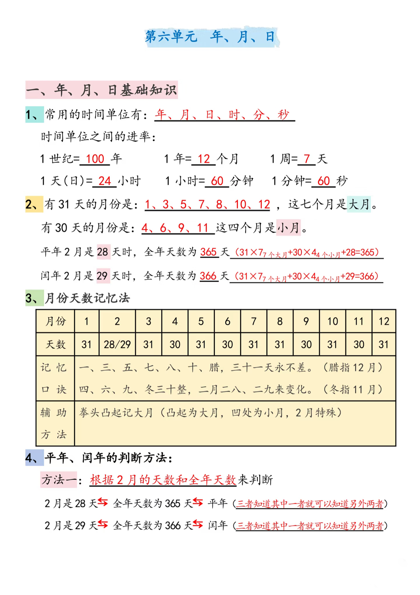
  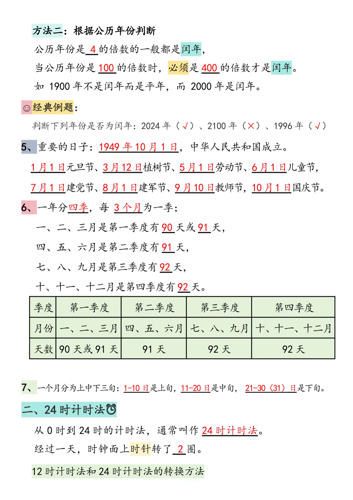
  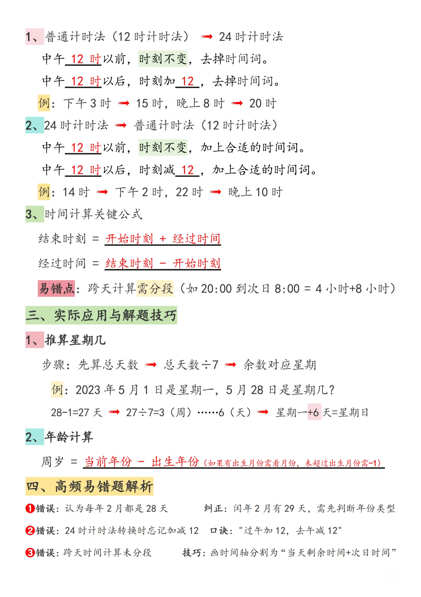

## 第七单元 小数的初步认识

  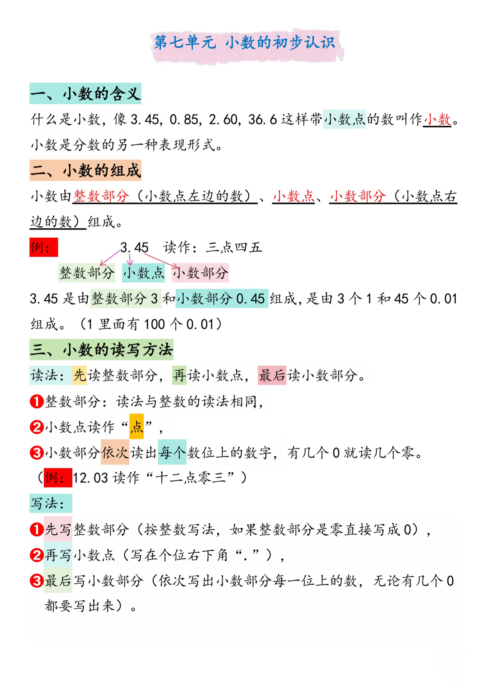
  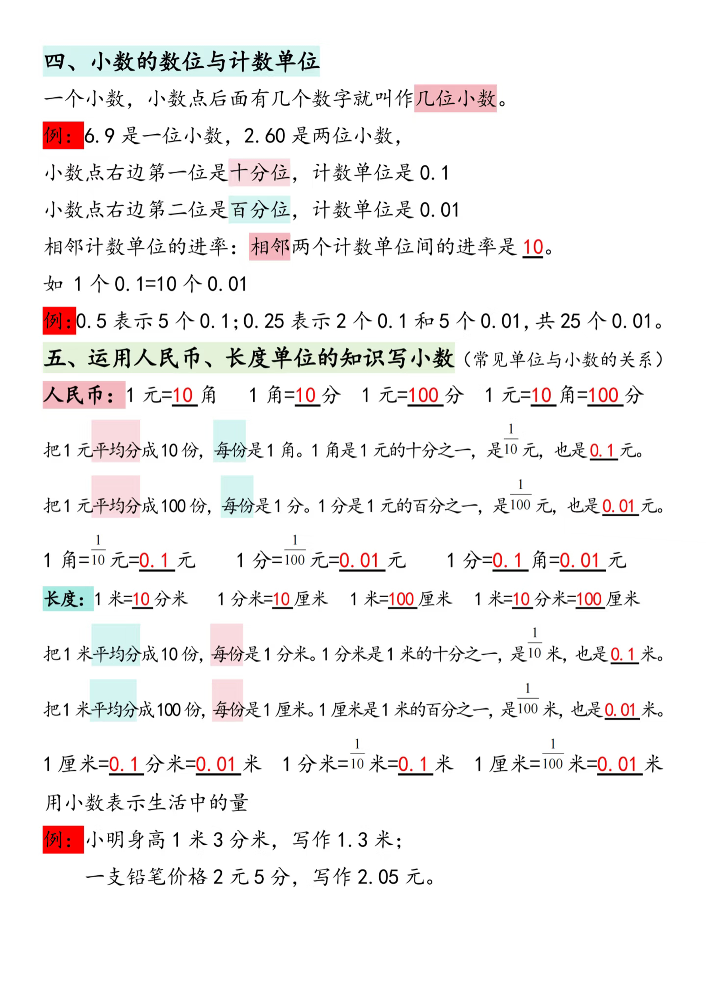

  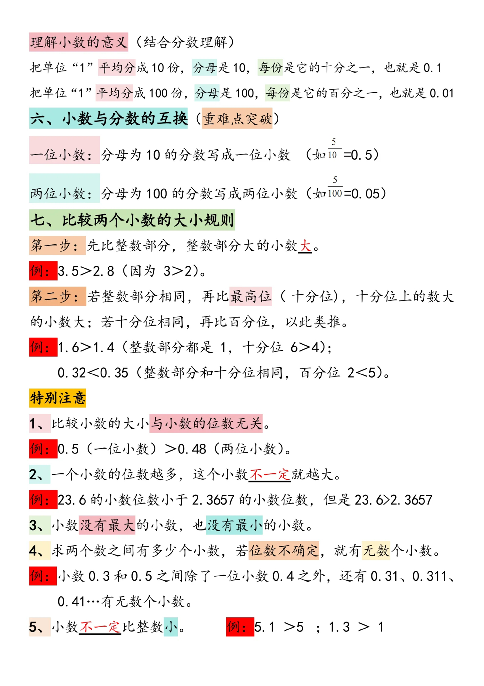
  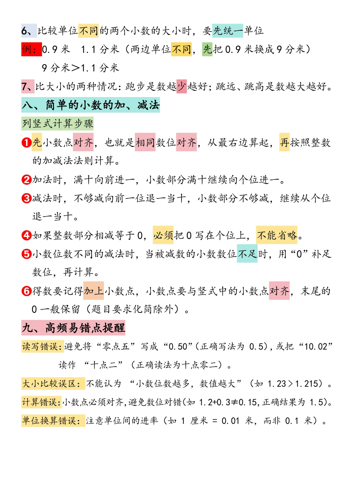

## 第八单元 数学广角-搭配（二）

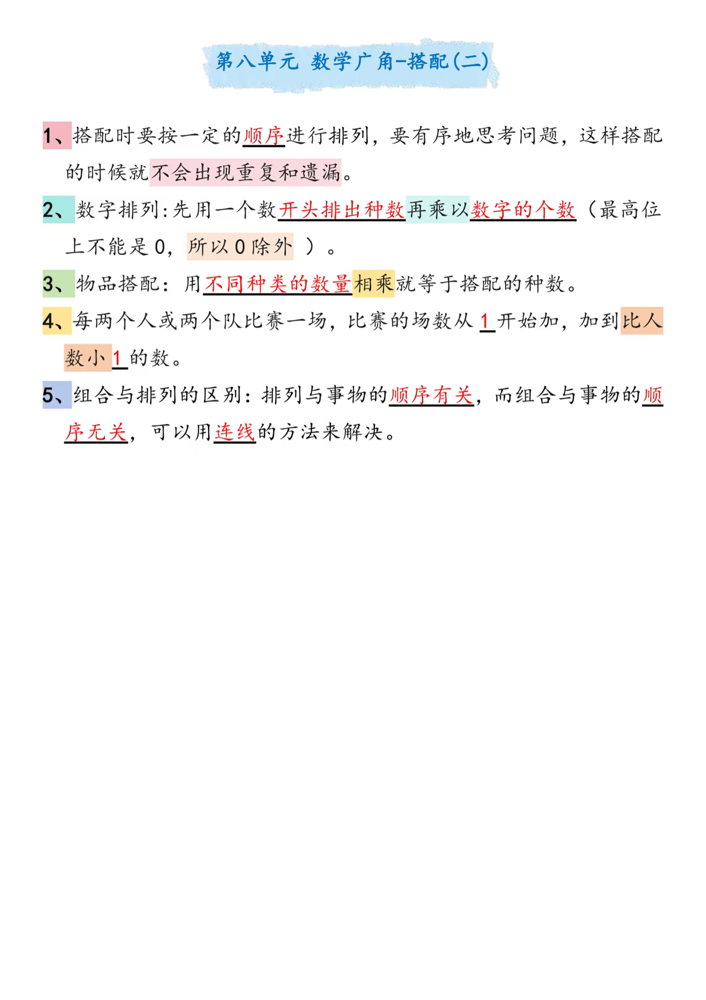